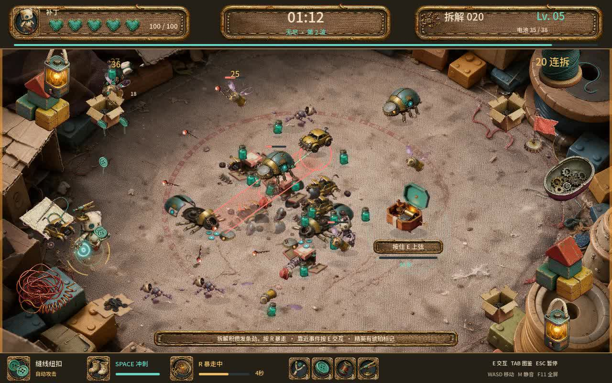

# 缝隙求生 · SCRAPBOUND 0.3

原创俯视角废土玩具 Roguelike。布偶「补丁」带着瓶盖锯、纽扣和发条，在旧玩具堆中求生。本版加入无尽模式、三条构筑路线、场中委托、敌人碰撞连锁、主动暴走及原创动态配乐。

## 开始玩

双击本目录 **缝隙求生.app** 或 **启动游戏.command**。这是依赖本机已安装 Godot 的启动器；游玩不用联网，所有图片、动作和音乐已保存在项目内。

主菜单默认选择 **无尽求生**，按 Enter 后选择一枚核心开始。也可选“三分钟挑战”。

## GitHub 与版本存档

[GitHub 仓库](https://github.com/spoy-ai/scrapbound) · [v0.3.0 发布](https://github.com/spoy-ai/scrapbound/releases/tag/v0.3.0) · [回退说明](版本回退说明.md)

当前版本固定在 `v0.3.0`。双击 **恢复稳定版.command**，会在旁边新建一份稳定版，保留当前工作目录。发布页附完整运行项目、原始美术视频素材、离线 Git 存档和校验值。本机也保存了同一份离线备份。

首次从 GitHub 下载或恢复时，启动器会自动导入资源；本机需先安装 Godot 4 标准版。仓库不保存缓存、临时录像、平台签名下载地址；原素材从发布页单独下载。

| 操作 | 按键 |
| --- | --- |
| 移动 | WASD / 方向键 |
| 自动挥锯、纽扣射击 | 靠近敌人，无需连点 |
| 短冲刺 | Space，带短暂无敌 |
| 上紧发条 | R，能量满后释放六秒暴走 |
| 音乐盒上弦 | 靠近后按住 E |
| 接取回收委托 | 靠近回收机按 E |
| 选择核心或改装 | 1 / 2 / 3，或鼠标点击；左右切换后 Enter 也可 |
| 暂停 / 继续 | Esc |
| 玩具动作图鉴 | Tab，左右切换、Space 看死亡、Esc 返回 |
| 总静音 / 全屏 | M / F11 |
| 调整背景音乐 | 菜单、暂停中的滑条，或 − / + |

## 无尽与挑战

**无尽求生**没有三分钟结束条件。时间向上累计，持续刷怪；每 45 秒进入下一波，敌人的生命和压力逐渐提高。精英有琥珀标记。第一位首领在 2:15 出现，后续按两分钟周期到来，同时最多一位首领。击败首领恢复 20 生命，继续向下一波推进。敌人移速和同时发动特殊攻击的数量有上限，仍保留读招与闪避空间。

**三分钟挑战**保留短局体验：坚持三分钟并拆解首领；若首领未死，可再战最多 45 秒。获胜后按 **E**，可以保留当前改装继续无尽，并恢复 35 生命。

无尽最长生存时间和挑战胜场在本机保存。暂停时可以回到标题重新选择路线。

## 三条核心路线

| 核心 | 开局能力 | 对应蓝图 |
| --- | --- | --- |
| 裂甲重锯 | 锯击伤害 +30%，每第三挥带扇形余震 | 余震锯齿扩大杀伤；棉芯收割在锯击拆解时恢复生命；拆甲钉让护甲暂时失效 |
| 缝线纽扣 | 双纽扣将附近敌人连接，冲刺穿过缝线触发强力断线伤害 | 拉力缝线加强断线与扩散；回缝弹头增加弹射；针脚回能让切线补充更多发条劲 |
| 线圈工坊 | 开局拥有环绕哨兵和近身脉冲 | 铜线共鸣让带电敌人死亡时连锁放电；回收电容让电池补充能量；分流哨兵增加火力来源 |

共 **10 类通用改装、9 类路线蓝图**。每次升级优先给出至少一张尚未升满的当前路线蓝图，其余选项可混搭通用改装。所有卡牌都有图标；已经封顶的属性会从对应选项池移出。

## 场中委托与连锁拆解

**音乐盒**：在出现后的时限内，靠近按住 E 累计上弦 9 秒。离开可以躲避敌人，但进度会缓慢回退；上弦的声音也会引来敌人。

**回收机**：靠近按 E 接单，此后 30 秒内拆解 14 个玩具。接单会招来精英和额外敌人，可以边移动边完成。

两类事件交替出现，失败不扣生命。完成后选择一件精制改装，同时永久增加 8% 伤害、恢复 20 生命、补充 25 点发条劲。事件奖励只能领取一次。

冲撞小车和首领能够撞击其他敌人，打出短暂的核心暴露；甲虫因此失去正面护甲。拆解暴露核心的玩具可波及附近敌人。缝线断裂、带电敌人拆解也会触发各自的连锁反馈，伤害与奖励有防重复和递归边界。

**上紧发条**：拆解、受击、惊险冲刺等积攒能量。满 100 后按 R，六秒内提高攻击伤害、出手频率和移动速度。暴走期间暂停回能，避免连续无限续杯。音乐和发条视觉表现同步增强。

## 原创动态配乐

《发条不眠》是一首 **140 BPM、约 82 秒、48 小节**的原创机械 breakbeat：音乐盒主题、切分贝斯、鼓组、和弦与失真拨弦共同构成推进感。

三条音轨在同一个播放器内保持采样同步。菜单以音乐盒和声为主；战斗加入鼓和低音；首领、长时间求生和暴走时增加高潮层。暂停、图鉴、升级和结算会平滑降低强度，曲目不会重新开始。循环也不会出现重新加载的停顿。

音符、音色与混音由本地离线作曲合成生成，没有使用第三方歌曲或外部采样。游戏中直接播放本地 WAV。完整试听见 `assets/v03/music/发条不眠.mp3`，编曲与来源说明见 `assets/v03/music/MUSIC.md`。

## 美术与制作记录

保留 0.2 的六种普通敌人、独立首领、各自死亡动画、动态纽扣、电池、绷带、地毯和织物界面。本版增加六张关键玩法图片，以及音乐盒、回收机两段真实生成的机械循环动作。

新增图片通过 Ai-DF 的 Seedream 5.0 Pro 生成；两个视频用 **Seedance 2.5，明确请求 480P、4 秒、24 fps**，实际方形原片为 640×640。离线去背景、固定底座和检查循环后，各制成 96 帧透明图集。原片、请求、任务编号和检查结果保存在 `source/v03/`。

沿用原有角色左右镜像朝向；移动碰撞按 60 Hz 更新并插值渲染。视频源为 24 fps，录像输出 60 fps 不表示模型原生生成 60 fps。运行过程中不生成素材、不解码视频、不合成音乐。

## 验证与交付文件

- `captures/v03/无尽与配乐实机演示.mp4`：13 秒、60 fps、含实际游戏混音的实机录像；使用预设中期构筑和自动操作，展示纽扣缝线、敌人冲撞与发条暴走。
- `captures/v03/checks.json`：147 项完整规则回归，包括无尽时限、首领周期、三路线、蓝图实效、事件、幂等奖励、连锁、输入及音乐时钟。
- `captures/v03/targeted-checks.json`：16 项接口与专项检查，覆盖电池/医疗包回能区别、冲锋末段扫掠、结算 R 键、暂停音量拖动不透传。
- `captures/v03/music-*.json`：17 项音乐播放器检查、5 项实际信号检查。母带 -13.7 LUFS，真实峰值 -1.7 dBFS，无削波。
- `captures/v03/art-*.png`：16 张实际引擎界面和事件动作检查图。
- `captures/v03_soak-report.json`：从开局运行至约 3:54 的加速战斗检查，跨过原结束边界，保持刷怪与升级；测试使用高生命值，不能当作真人难度评价。
- `captures/v03_endless-report.json`：从预设中期场景继续至 4 分钟后的图形运行检查，同样使用测试生命值。
- `captures/v03_native-report.json`：通过原生窗口实际选择核心、冲刺并暂停，最终停在缝线路线的暂停面板。

规则检查、实际图形运行和键鼠操作验证实现与显示；爽感、难度和音乐口味仍以玩家试玩反馈为准。

当前入口：`main.tscn` → `game_v3.gd`。`game.gd` 与 `game_v2.gd` 保留共用逻辑，`systems/music_director.gd` 管理音乐。0.2 修改前的代码和说明保存在 `source/v02-code/`。本次没有改动旧的素材原片或平台配置。
